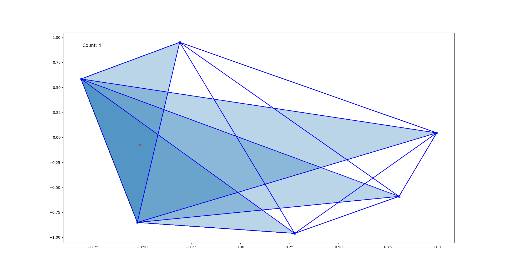
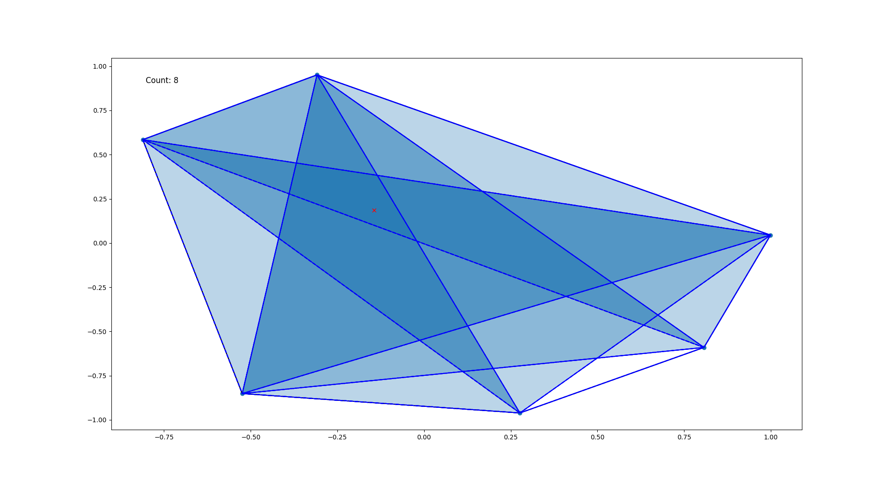

# parsimonious-inference-maximization
This repo contians our work related to Inference Maximizing Configurations and Inference Maximizing Sequences, for Knuth's Parsimonious Algorithms.

## Files:
+ `parsimonious_brute_force.py`: This file contains the implementation of parsimonious CC computation (with data structures capturing the first 3 axioms and axiom-4 being used for parsimonious inference) and a brute force implementation for finding inference maximizing configurations.
+ `backward_construction_regions.py`: This file provides a helper visualization utility for backward construction, enumerating different type of regions in which you can place your points and see which region leads to maximum inferences if you place a point there

The following images show the backward construction utility at work for 6 point case, showing the number of inferences we get after placing points in a certain region:

